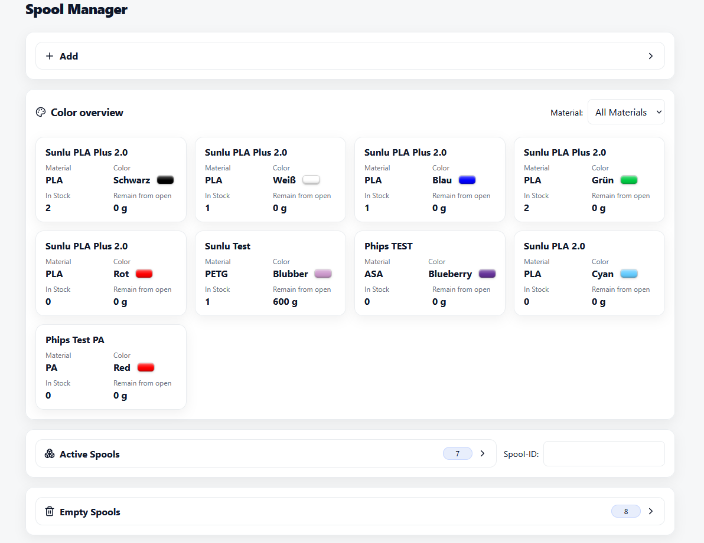
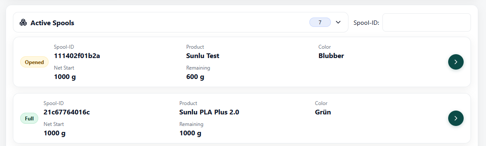
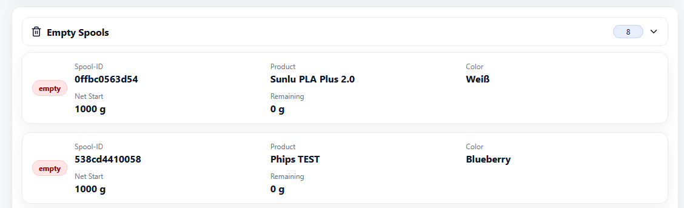
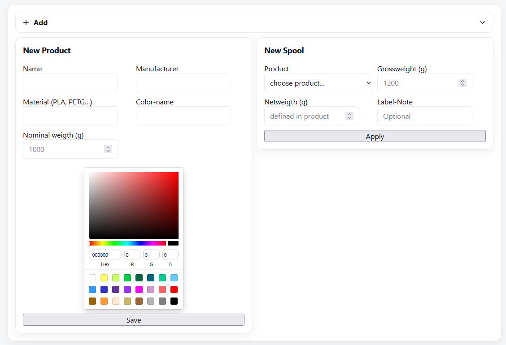
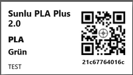

# 🎛️ SpoolManager

SpoolManager is a web application to manage 3D printing filament products and spools.
It provides a modern React frontend, a FastAPI backend, and runs seamlessly in Docker.

---

## ✨ Features

* 📦 Manage filament **products** and **spools**
* 🎨 Color overview
* 🔄 API powered by **FastAPI**
* 💾 Persistent storage with **SQLite**
* 🌍 Multi-language support (German 🇩🇪 / English 🇬🇧) and more to add
* 🏷️ Generate QR code labels, ready to print anytime – optimized for Dymo 32×57 mm labels (S0722540 / 11354)
* 🐳 Easy deployment via **Docker Compose**
* 🖥️ Runs anywhere that runs Docker

---

## 📸 Screenshots

* **Dashboard View**
  

* **Active Spools**
  

* **Empty Spools**
  

* **New Products and Spools**
  

* **Label**
  

---

## 🚀 Quickstart

See [Quickstart Guide](./docs/QUICKSTART.md) for the fastest way to run SpoolManager.
See [Installation Guide](./docs/INSTALLATION.md) for detailed setup instructions including development.

---

## 📜 License

MIT License – feel free to use and adapt.

---

## 👨‍💻 Author

Built with ❤️ by Phips + ChatGPT
